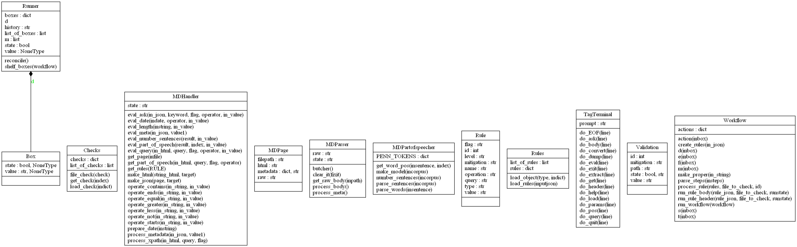
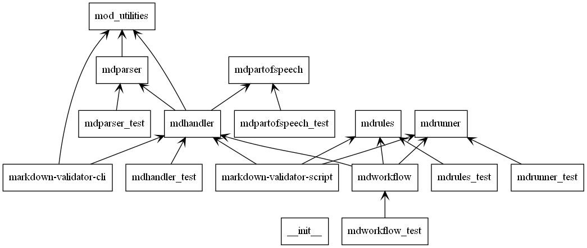

About the design of the validator
==================

The tool should allow for on-demand and programmatic assessment of documents 
using a document-based format for describing the rules that make up a particular 
document type. That is, the rules apply to the document can be keyed from 
metadata such as a document type. The rules can be applied both on demand and 
can produce a validation report on a file or repository. Both the on-demand and 
batch process produce an overall summary validation status of pass/fail or 
true/false.

Each validation error should produce:
* Pass fail state for the document.
* Pass fail state for the validation item.
* A mitigation description.
* A location for the validation failure.

 
